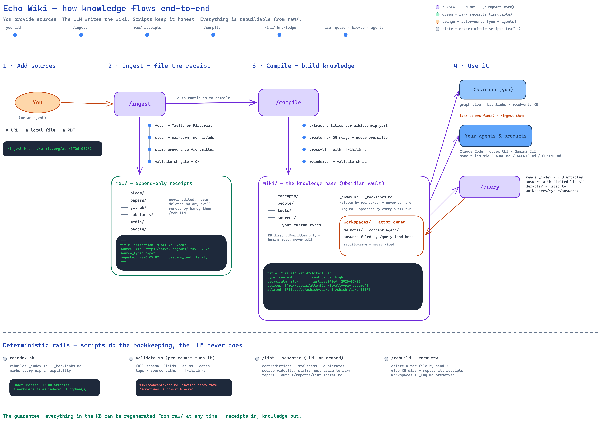

# Echo Wiki

A generic, LLM-maintained knowledge base system. Ingest sources, compile a structured wiki, browse in Obsidian. Works with any domain — AI research, finance, healthcare, marketing, or anything else.

> **[Read the docs](https://echotheorylabsai.github.io/echo-wiki/)** for full setup guide, configuration reference, and usage examples.

## How It Works



*The full pipeline: sources → `/ingest` → `raw/` receipts → `/compile` → `wiki/` knowledge → used via Obsidian, `/query` (with workspace write-back), and agents — with the deterministic script rails underneath. Editable source: [echo-wiki-flow.excalidraw](docs/public/assets/echo-wiki-flow.excalidraw).*

```
  URLs / Files / PDFs
         |
         v
  +--------------+
  |   /ingest    |  Fetch + clean source -> raw/
  +--------------+
         |
         v
  +--------------+
  |   /compile   |  Extract entities, build articles -> wiki/
  +--------------+
         |
         v
  +--------------+
  |  /rebuild    |  Stage + validate a replacement (after deletion)
  +--------------+
         |
         v
  +--------------+
  |   Obsidian   |  Browse, graph view, backlinks
  +--------------+
```

> `/rebuild` is only needed after manually deleting raw source files. Normal workflow is `/ingest` → `/compile`.

Newly ingested sources always include a visible Markdown heading so compiled claims can cite a stable evidence location. See the validation guide for the one-time migration required by legacy headingless raw sources.

**The LLM writes all wiki content.** You provide sources, the LLM maintains `wiki/`. You never edit KB articles directly — just read them in Obsidian. You can create your own notes and drafts in `wiki/workspaces/`.

```
raw/                          wiki/ (Obsidian vault)
├── blogs/                    ├── _index.md        <- Master index
│   └── source-article.md    ├── _backlinks.md    <- Cross-reference map
├── papers/                   ├── _log.md          <- Activity log (auto-created)
├── people/                   ├── concepts/        <- Default entity types
├── substacks/                │   └── topic.md
├── github/                   ├── people/          <- (configurable via
└── media/                    │   └── person.md
                              ├── tools/           <-  entity_types in config)
                              │   └── tool.md
                              ├── sources/         <- Source summaries
                              │   └── summary.md
                              └── workspaces/      <- Actor workspaces
                                  └── my-notes/    <- Your notes
```

## Quick Start

```bash
# 1. Clone
git clone <repo-url> my-wiki && cd my-wiki

# 2. Set up environment
cp .env.example .env
# Edit .env — add your API keys

# 3. Configure your domain
# Edit _meta/wiki.config.yaml — set name, description, domains

# 4. Install hooks
ln -sf ../../hooks/pre-commit.sh .git/hooks/pre-commit
ln -sf ../../hooks/token-count.sh .git/hooks/post-commit

# 5. Open in Obsidian
# File > Open folder as vault > select the wiki/ directory

# 6. Ingest your first source
/ingest https://example.com/article
```

## Configuration

All customization lives in one file: `_meta/wiki.config.yaml`

```yaml
wiki:
  name: "My Wiki"
  description: "What this wiki is about"

domains:
  - name: "topic"
    label: "Topic Label"

entity_types:                  # What kinds of articles to create
  - name: concept              # (defaults shown — customize for your domain)
    dir: concepts
    label: Concepts
    description: "Ideas, theories, patterns"
  - name: person
    dir: people
    label: People
    description: "Researchers, authors, key figures"
  - name: tool
    dir: tools
    label: Tools
    description: "Software, platforms, frameworks"
  - name: source-summary
    dir: sources
    label: Sources
    description: "Summaries of ingested raw sources"

vault:
  dir: wiki
  default_workspace: my-notes

defaults:
  decay_rate: medium    # fast | medium | slow
  confidence: medium    # high | medium | speculative
```

See `.env.example` for required API keys.

## Core Operations

| Command | What it does |
|---|---|
| `/ingest <url>` | Fetch URL, save clean markdown to `raw/` |
| `/ingest <path>` | Import local file (md, pdf) to `raw/` |
| `/compile <path>` | Compile raw source into wiki articles |
| `/compile all` | Recompile entire wiki |
| `/rebuild` | Stage, validate, and commit a KB replacement from remaining raw sources |
| `/index` | Rescan `wiki/` and update `_index.md` and `_backlinks.md` |
| `/lint` | Run semantic checks, produce report |
| `/lint all` | Lint entire wiki |
| `/query <question>` | Answer from the wiki with citations; file durable answers and capture unsupported questions as knowledge gaps |
| `/context <product-area>` | Create or refresh a concise, evidence-backed context pack for a component or product area |
| `/maintain` | Refresh indexes, write diagnostics and a prioritized queue, and append the activity log without changing factual knowledge |

## Keeping Content Fresh

Echo Wiki is command-driven, not a background synchronizer. New sources flow through `/ingest` → `/compile`, while context packs, durable answers, knowledge gaps, and the maintenance queue refresh only when you run `/context`, `/query`, or `/maintain` again. For the complete change-to-next-step guide—including manual raw imports, source deletion, and the current same-URL replacement limitation—see [Keeping Content Fresh](https://echotheorylabsai.github.io/echo-wiki/keeping-fresh).

## Workspaces

Users and agents can create content alongside KB articles in `wiki/workspaces/`:

```
wiki/workspaces/
├── my-notes/              <- Default human workspace (ships with template)
│   ├── research-log.md
│   └── todo.md
├── content-creator/       <- Agent workspace (created on demand)
│   └── drafts/
├── knowledge-maintenance/ <- System-managed context packs and knowledge gaps
│   ├── context/
│   └── gaps/
└── social-media/          <- Agent workspace
    └── drafts/
```

- **Zero registration** — just create a directory under `workspaces/`
- **Agents and humans are peers** — same structure, same rules
- **Cross-zone wikilinks** — workspace notes can link to KB articles and vice versa
- **Rebuild-safe** — `/rebuild` never touches `workspaces/`
- Run `/index` after creating workspace content to update the master index

### Engineering Context Packs

`/context <product-area>` creates a compact starting page for developers and coding agents. It summarizes the current architecture, constraints, decisions, open questions, and the articles to read next. Context packs are rebuild-safe derived content in `workspaces/knowledge-maintenance/context/`; factual paragraphs link to exact supporting locations in `raw/` rather than creating a second knowledge store.

When `/query` cannot provide a fully evidence-backed answer, it records the question, search scope, missing evidence, and a suggested next source in `workspaces/knowledge-maintenance/gaps/`. Repeated unanswered questions update the same note, so the wiki's next improvements are driven by real developer and agent usage.

`/maintain` is safe, manual maintenance: it refreshes the generated index/backlinks files, writes the lint report and prioritized maintenance queue, and appends the activity log when you run it. It surfaces broken evidence, stale or contradictory articles, recurring knowledge gaps, and orphan/duplicate candidates, but never changes factual content by itself.

## Data Flow

```
                    /ingest
                       |
    URL -----> [Tavily/Firecrawl] -----> raw/<category>/<source>.md
    File ----> [copy + frontmatter] --/        |
                                               |
                    /compile                   |
                       |                       |
    raw source --------+                       |
         |                                     |
         v                                     |
    Extract entities (per config entity_types)  |
         |                                     |
         v                                     |
    For each entity:                           |
      exists? --> MERGE (add info, keep old)   |
      new?    --> CREATE (full frontmatter)     |
         |                                     |
         v                                     |
    Run reindex.sh (_index + _backlinks)       |
    Run validate.sh (schema gate)              |
    Append to _log.md                          |
         |                                     |
         v                                     |
    wiki/ <-- ready for Obsidian               |
                                               |
                    /rebuild                    |
                       |                       |
    [delete raw] --> stage KB --> replay sources --> validate --> replace live KB
                     (workspaces preserved; failure leaves live KB unchanged)
```

## Validation

**Deterministic scripts (no LLM):**
- `./hooks/validate.sh [--all|--staged|<paths>]` — full frontmatter schema (required fields, enums, dates, tags vs domains), source-path existence, filename rules, wikilink resolution, structure integrity
- `./hooks/reindex.sh` — regenerates `_index.md` and `_backlinks.md` deterministically; skills never hand-write them
- **Pre-commit hook** runs `validate.sh --staged` automatically on every commit

**Semantic lint (`/lint`, on-demand, LLM):**
- Contradictory claims across articles
- Stale content past decay thresholds
- Orphaned articles (from explicit `_No inbound links._` markers)
- Missing concepts (referenced but no article)
- Duplicate concepts under different names
- Source fidelity (sampled) — claims must trace to cited raw sources

**Token count (post-commit, informational):**
```bash
./hooks/token-count.sh    # Run manually anytime
# Also runs after each commit (never blocks)
```

## Directory Structure

```
echo-wiki/
├── _meta/
│   ├── wiki.config.yaml      # Your wiki configuration
│   ├── prompts/               # Shared step references (structure-check)
│   └── schemas/               # Frontmatter validation schema
├── raw/                       # Source documents (append-only, backend)
├── wiki/                      # Obsidian vault (user-facing)
│   ├── concepts/              # KB: default entity type directories
│   ├── people/                #     (configurable via entity_types in config)
│   ├── tools/
│   ├── sources/
│   ├── workspaces/            # Actor workspaces (human + agent)
│   │   └── my-notes/          # Default human workspace
│   ├── _index.md              # Master index
│   ├── _backlinks.md          # Cross-reference map
│   └── _log.md                # Activity log (auto-created by skills)
├── output/reports/            # Lint reports, query results, token counts
├── hooks/                     # validation, indexing, pre-commit, and rebuild transaction scripts
├── tests/                     # Fixture-based tests for the hooks (run-tests.sh)
├── .claude/skills/            # Agent Skills (ingest, compile, rebuild, lint, index, query, context, maintain)
├── docs/                      # VitePress documentation site
├── .env.example               # API key template
├── CLAUDE.md                  # Claude Code instructions
└── README.md
```

## Provider Support

Echo Wiki uses the [Agent Skills](https://agentskills.io) open standard. Works with:

- **Claude Code** — via CLAUDE.md + .claude/skills/
- **Codex CLI** — via AGENTS.md + .claude/skills/
- **Gemini CLI** — via GEMINI.md + .claude/skills/
- **Any Agent Skills-compatible agent**

## License

MIT
